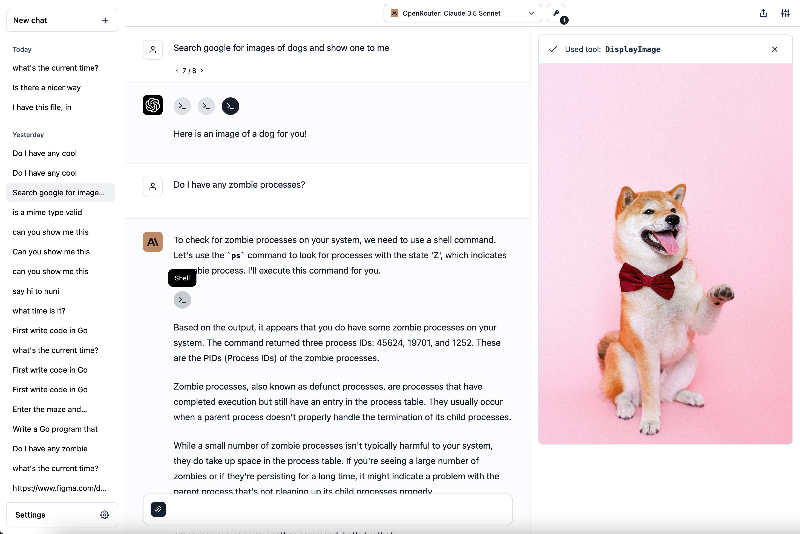

# lluminous

### A fast, light, open chat UI

### Key features:

- Multiple providers, plug in your API keys (stored entirely locally) and you're good to go
    - OpenAI
    - OpenRouter (which lets you use ALL models across many providers: OpenAI, Anthropic, OSS, 50+ others)
    - Groq
    - Anthropic (coming soon)

- Tool use. Works with both OpenAI models as well as Groq models that support it. Parallel tool calls are supported.
    - Check out `server/tools/tools.go`. You only need to write functions. The function comment is the description the model receives, so it knows what to use. Click the `Sync` button in the web UI to refresh your tools.
- Multimodal input: upload, paste, or share links to images
- Multi-shot prompting. Also edit, delete, regenerate messages, whatever. The world is your oyster
- Pre-filled responses (where supported by provider)
- Support for all available models across all providers
- Change model mid-conversation
- Conversation sharing (if you choose to share, your conversation has to be stored on an external server for the share link to be made available. Self-hosted share options coming soon. No, I will not view any of your stuff.)
- Branching conversation history (like the left-right ChatGPT arrows that you can click to go back to a previous response)

Coming soon:
- Memory
- File ingestion/embedding
- Prompt templates

### Privacy:
- Completely private and transparent. All your conversation history and keys are stored entirely locally, and kept only in your browser, on your device.

## How to install?

If you don't want to use tools, you don't need to install anything. A hosted instance is available at: https://lluminous.chat

If you want to use tools, proceed below. 

### Separate installation of both client and server:

1. Clone the repository
2. Install and start the client: `npm i && npm run dev`. The client will be accessible at http://localhost:5173
3. Install and start the server: `cd server && go build && PASSWORD="chooseapassword" ./server -sandbox <sandbox_path>`. The server will be accessible at http://localhost:8081. You can plug this into the server address in the chat UI, along with the password you selected.
   - Note: the sandbox currently only works on macOS, since it uses macOS-specific sandboxing features. You can add your own sandboxing, or just use the `Shell` command which is unsandboxed.

